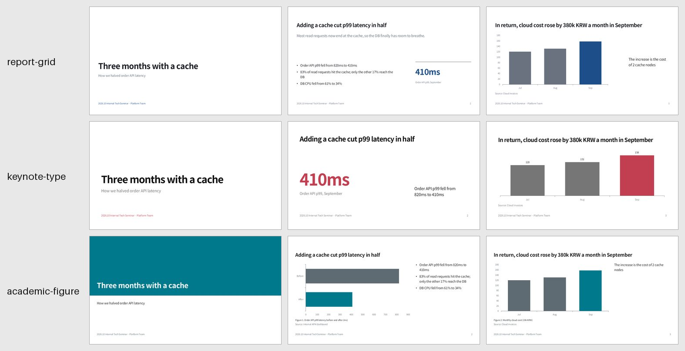
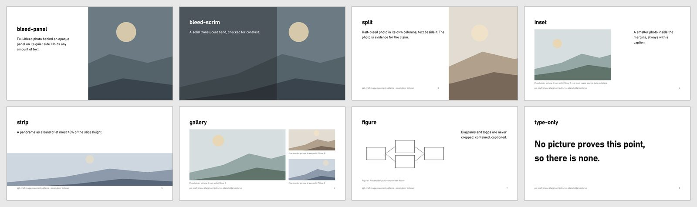
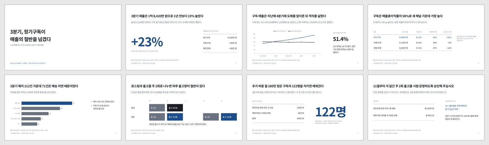
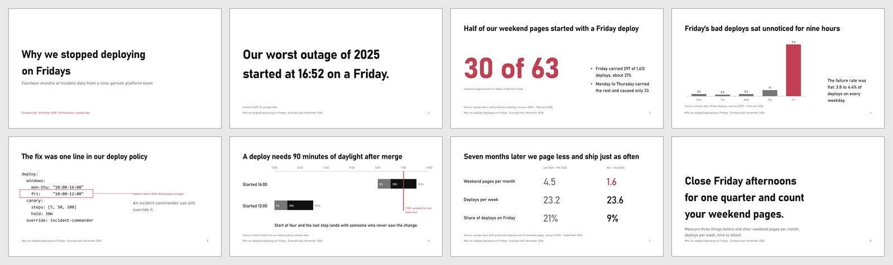
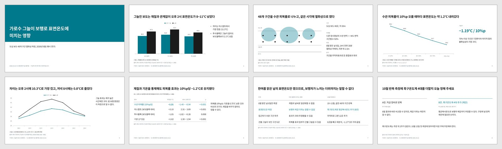

# ppt-craft

A Claude Code plugin that builds editable PowerPoint (`.pptx`) decks that don't look AI-made.

Most AI-generated decks share the same tells: three icon cards in a row, purple gradients, centered everything, emoji bullets, invented numbers, "Key Takeaways" endings. ppt-craft is built around a catalog of these tells (`rules/tells.md`) and the opposite signals of human-made work: real materials, specific facts, restraint, a consistent personality. Every deck is checked against both from rendered screenshots before you get it.

Full guide: [docs/USAGE.md](docs/USAGE.md) · 한국어: [docs/USAGE.ko.md](docs/USAGE.ko.md)

## Gallery

The examples use fictional sample content, and no photos are included.

| Style candidates (pick from rendered slides) | Image placement patterns |
|---|---|
|  |  |

| Business report | Conference talk | Research talk |
|---|---|---|
|  |  |  |

Each example folder has the `build.py` and `style.json` that made it. See [Examples](docs/USAGE.md#examples).

## What it does

1. **Brief.** A short interview covering audience, goal, length, sources, references and tone.
2. **Style.** Three style candidates are rendered from your references (a `.pptx`, images, a URL) or built-in presets, and you pick from real slide images, not JSON. Fonts are chosen from rendered comparisons and remembered for next time. If the deck uses photos, you also pick a photo treatment and the image placements you like from one rendered comparison of your own photo.
3. **Build.** A storyboard where the slide titles alone carry the argument, then a native, editable `.pptx`:
   - real charts, not drawn shapes
   - proper Korean line breaking and East Asian fonts
   - native image crops you can re-crop in PowerPoint
   - image placement chosen per slide from its content: full-bleed photos behind a solid panel or a translucent scrim checked for text contrast, half-bleed split, captioned inset, strip, gallery, or no image at all
   - one consistent treatment across all photos (none, gray, duotone), plus an optional subtle texture on a cover or section slide
4. **Review.** A separate reviewer agent that never sees the build code judges the deck from rendered captures, plus an automatic text/XML lint. It loops up to 3 times until there are no blocker or major issues.

**Optional free assets, fetched at runtime with your consent:**
- photos (Wikimedia Commons, Openverse; Pexels/Pixabay with a free key)
- AI-generated images (Cloudflare Workers AI / Pollinations / Hugging Face with a free key; keyless AI Horde for small slots)
- icons (Iconify, permissive licenses only, inserted as editable SVG)
- free fonts (a curated catalog, installed per user without admin rights)

Credits and licenses are recorded and added to the deck.

## Install

From the shell:

```bash
claude plugin marketplace add rrrr66254/ppt-craft
claude plugin install ppt-craft@ppt-craft
```

Or inside a Claude Code session:

```
/plugin marketplace add rrrr66254/ppt-craft
/plugin install ppt-craft@ppt-craft
```

Then run `/reload-plugins` or restart. To try it from a local clone instead, run `claude --plugin-dir ./ppt-craft`.

Auto-update is off by default for this marketplace. Turn it on in `/plugin` → Marketplaces → ppt-craft, or update with `claude plugin update ppt-craft@ppt-craft`. Version pinning, team setup and uninstalling: [docs/USAGE.md#install](docs/USAGE.md#install).

### Requirements

- **Python 3.10+.** Install the dependencies with `pip install -r requirements.txt` (python-pptx, Pillow, resvg-py). The plugin offers to do this for you on first use.
- **A renderer, needed for style candidates and review:**
  - Windows: Microsoft PowerPoint (used automatically), or
  - LibreOffice plus `pdftoppm` (poppler) or `pip install pymupdf` (works on macOS and Linux too)

## Use

```
/ppt-craft:deck <topic, source file, or an existing decks/<slug> folder>
/ppt-craft:deck-review <file.pptx>
```

You can also just ask, e.g. "make a 10-slide deck about our cache rollout" or "PPT 만들어줘".

Work happens in `decks/<slug>/` in your current folder: `brief.md`, `style.json`, `outline.md`, `build.py` and `out.pptx`. You can stop at any point and resume later with `/ppt-craft:deck decks/<slug>`.

The stage skills (`deck-brief`, `deck-style`, `deck-build`) can be run on their own, but `/ppt-craft:deck` normally drives them.

### Optional API keys (environment variables)

| Variable | Used for |
|---|---|
| `PEXELS_API_KEY` | Pexels photo search (free key) |
| `PIXABAY_API_KEY` | Pixabay photo search (free key) |
| `CLOUDFLARE_ACCOUNT_ID`, `CLOUDFLARE_API_TOKEN` | Image generation with FLUX.1-schnell (free tier) |
| `POLLINATIONS_API_KEY` | Image generation (free key) |
| `HF_TOKEN` | Image generation via Hugging Face (small free credit) |

Set keys as environment variables and restart Claude Code. Never paste keys into the chat.

## Where it runs

ppt-craft is built for Claude Code (terminal, IDE extensions, desktop app Code tab). It needs a local Python 3.10+ and a slide renderer (PowerPoint on Windows, or LibreOffice). In claude.ai chat and Cowork the skills load, but without Python and a renderer the deck skill stops at its first check and shows install instructions, and chat does not load the reviewer agent.

## What it runs, sends and stores

Everything below is visible in `scripts/` and `skills/`. Nothing is minified or downloaded and executed.

**Runs on your machine**
- Python scripts from this plugin (`scripts/*.py`, `lib/deckkit/`), started by the skills.
- Your deck's own `build.py`, which Claude writes in `decks/<slug>/`.
- PowerPoint through COM automation on Windows (PowerShell, opening a temporary copy of the deck; PowerPoint is closed only if the script started it), or LibreOffice `soffice` in headless mode, to export slide images.
- `pip install -r requirements.txt` (python-pptx, Pillow, resvg-py), only after you agree, when a module is missing.

**Network: off until you agree**, asked once per session. If you decline, only your own images and installed fonts are used. When you agree, only these requests are made:

| Purpose | Destination | What is sent |
|---|---|---|
| Photo search and download | `api.openverse.org`, `commons.wikimedia.org` and the image hosts they link to (e.g. `upload.wikimedia.org`); `api.pexels.com`, `pixabay.com` only if you set their keys | Your search words; the key for Pexels/Pixabay |
| AI image generation | `api.cloudflare.com`, `gen.pollinations.ai`, `huggingface.co` / `router.huggingface.co` only if you set their keys; otherwise `aihorde.net` (volunteer-run) | Your image prompt and size; the key for the provider you set |
| Icons | `api.iconify.design` | Your search words and the icon name |
| Fonts | `fonts.google.com` and the font file URLs it returns; `api.github.com` and GitHub release downloads | The font family name |

Keys are read from environment variables you set yourself (`PEXELS_API_KEY`, `PIXABAY_API_KEY`, `CLOUDFLARE_ACCOUNT_ID`, `CLOUDFLARE_API_TOKEN`, `POLLINATIONS_API_KEY`, `HF_TOKEN`), sent only to that provider, and never printed or written to files. Keep confidential text out of search words and prompts. Requests carry the User-Agent `ppt-craft/<version>`. There is no telemetry and no other server.

**Writes on your machine**
- `decks/<slug>/` in your current folder: brief, style, outline, `build.py`, downloaded and treated assets, renders, `out.pptx`.
- The plugin data folder (`~/.claude/plugins/data/ppt-craft-ppt-craft/`): your remembered font choice and saved styles.
- Fonts, only when you ask to install one: your per-user font folder (Windows: `%LOCALAPPDATA%\Microsoft\Windows\Fonts` plus its per-user registry entry; macOS: `~/Library/Fonts`; Linux: `~/.local/share/fonts`). No admin rights are used.
- Temporary files in the system temp folder during rendering, removed afterwards.

## License

MIT. See [LICENSE](LICENSE) and [NOTICE](NOTICE) for credits to the design references this plugin's rules paraphrase.

---

### 한국어 요약

AI가 만든 티가 나지 않는 PPT(.pptx)를 만드는 Claude Code 플러그인입니다.

- **스타일 고르기:** 레퍼런스에서 스타일을 따온 후보를 실제 렌더링 이미지로 비교해서 고릅니다.
- **제작:** 편집할 수 있는 .pptx로 만듭니다.
- **이미지:** 슬라이드 내용에 맞춰 사진 배치(전면·분할·인셋·띠·갤러리)를 고르고, 사진 톤 처리는 실제 렌더링으로 비교해서 정합니다.
- **검수:** 별도의 검수 에이전트가 캡처를 보고 다시 확인합니다.
- **사용:** `/ppt-craft:deck 주제`로 시작합니다. 한국어로 요청하면 한국어로 답합니다. 중간에 멈췄다면 `/ppt-craft:deck decks/<slug>`로 이어서 합니다.
- **기존 자료 검수:** `/ppt-craft:deck-review 파일.pptx`
- **네트워크와 저장:** 네트워크는 세션마다 한 번 동의를 받은 뒤에만 씁니다. 접속하는 곳과 보내는 내용, 내 PC에 저장되는 위치는 위의 "What it runs, sends and stores"에 모두 적혀 있습니다. 텔레메트리는 없습니다.
- **지원 환경:** Claude Code 기준입니다. claude.ai 채팅과 Cowork에서는 로컬 Python과 렌더러가 없으면 설치 안내를 보여 주고 멈춥니다.

설치:

```bash
claude plugin marketplace add rrrr66254/ppt-craft
claude plugin install ppt-craft@ppt-craft
```

세션 안에서는 `/plugin marketplace add rrrr66254/ppt-craft`, `/plugin install ppt-craft@ppt-craft`를 실행한 뒤 `/reload-plugins`를 실행하세요. Python 3.10 이상과 렌더러(Windows는 PowerPoint, 그 밖에는 LibreOffice)가 필요합니다.

자세한 사용법: [docs/USAGE.ko.md](docs/USAGE.ko.md)
